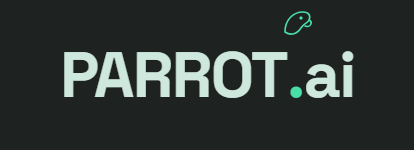

# 

PARROT.ai is a local web application that gives you **unlimited, 100% free AI image generation**. It does this by acting as a smart, automated proxy for powerful public image generators (like Perchance). 

Instead of paying for expensive monthly subscriptions or dealing with advertisements and warning pop-ups on public sites, PARROT.ai handles everything in the background and presents it inside a premium, dark-themed (Sage-Mint Obsidian) studio dashboard.

---

## 🌟 Core Features

*   **100% Free & Unlimited:** No credit limits, tokens, daily caps, or account registrations. You can generate as many images as you like.
*   **Website Proxy Automation:** It runs a real Google Chrome browser in the background, routes prompts through public generation sites, and brings the images back.
*   **Automatic Warning Bypass:** A background script automatically ticks "18+" boxes, dismisses NSFW filter pop-ups, and clicks "Agree" so your creative process is never interrupted.
*   **Real-time Image Streaming:** Images are scraped and streamed to your dashboard (via Server-Sent Events) one-by-one the exact second they finish rendering.
*   **Local Auto-Saving:** Every image you create is automatically saved as a high-quality PNG file in a local folder called `gens/`.
*   **Parameter History Gallery:** Stores your past prompts, seeds, styles, and dimensions. You can filter mature content, download individual files, or click a button to load old settings back into your generation deck.
*   **Prompt Enhancer:** Built-in helpers to instantly append professional photographic descriptors and negative prompts (things to avoid, like deformities or blurriness).
*   **Self-Healing Network:** Automatically pauses generation if your internet connection drops, enters a retry loop, and recovers once the connection is restored.

---

## ⚙️ How It Works (Behind the Scenes)

PARROT.ai uses a **Split Browser Proxy Automation Architecture**. Instead of direct API requests, it translates actions on your local dashboard into actions inside a hidden browser.

```
                      ┌────────────────────────────────┐
                      │      Sage-Mint Dashboard       │ (Local browser UI)
                      └───────────────┬────────────────┘
                                      │ SSE Image Stream (Real-Time)
                      ┌───────────────▼────────────────┐
                      │    FastAPI Backend Server      │ (app.py)
                      └───────────────┬────────────────┘
                                      │ DrissionPage Driver (Chrome Control)
               ┌──────────────────────┴──────────────────────┐
               ▼                                             ▼
  ┌───────────────────────────┐                 ┌───────────────────────────┐
  │     Primary Main Tab      │ (Locked)        │    Temporary Extra Tab    │ (Spawned on-demand)
  │ Warmed-up on startup to   │                 │ Opens if main tab is busy.│
  │ handle single runs.       │                 │ Closes immediately after. │
  └───────────────────────────┘                 └───────────────────────────┘
```

1.  **Warm-up:** When the backend server boots, it launches a hidden Google Chrome instance off-screen (to avoid cluttering your desktop) and prepares a primary generation tab.
2.  **React Value Injection:** Standard automation tools fail because Perchance is built on React. PARROT.ai bypasses this by getting the native browser property setters to force input and change events, syncing your settings with React's state.
3.  **Concurrency (Tab Pool):** If you request a new batch of images while the main tab is working, the backend automatically spawns temporary browser tabs (up to 5 total) in the background and closes them when done.
4.  **Instant Scraper:** The server polls the background page for new `` or `<canvas>` elements, converts them to Base64 code, and yields them down a stream back to the UI.

---

## 🛠️ Technology Stack

*   **Backend:** Python, FastAPI, Uvicorn
*   **Browser Control:** DrissionPage (bypasses Cloudflare bot checks by driving a real Chrome browser)
*   **Frontend:** HTML5, Vanilla CSS3 (Obsidian Mint theme), Vanilla JavaScript (ES6)
*   **Storage:** Browser Local Storage (keeps history lists persistent without a database)

---

## 🚀 Getting Started

### Prerequisites
*   [Python 3.10+](https://www.python.org/) installed on your system.
*   [Google Chrome](https://www.google.com/chrome/) browser installed.

### Installation & Run

1.  Clone or download this project folder to your local machine.
2.  Open your terminal in the project directory and install the required dependencies:
    ```bash
    pip install -r requirements.txt
    ```
3.  Start the local backend server:
    ```bash
    python -u app.py
    ```
4.  Open your web browser and navigate to:
    ```
    http://127.0.0.1:8000
    ```

Once the loading overlay disappears (which means the background Chrome tab has successfully warmed up), you are ready to generate images!

---

## 📂 Project Structure

```
├── app.py                      # FastAPI server & Chrome automation driver
├── requirements.txt            # Python library dependencies
├── all_styles.json             # Reference list of 106 art styles
├── exact_parrot_logo_text.png  # Extracted brand text logo
├── exact_parrot_logo_icon.png  # Extracted brand SVG icon
├── gens/                       # Local folder where PNG generations are saved
└── static/
    ├── index.html              # Frontend user dashboard structure
    ├── style.css               # Luxury Sage-Mint dark mode theme styles
    ├── app.js                  # Frontend events, streaming, & local storage
    └── bird.png                # Original bird silhouette favicon icon
```

---

## 📜 Credits
* **Created by**: Afroz Alam
* **Contact Email**: [codefather.inbox@gmail.com](mailto:codefather.inbox@gmail.com)
